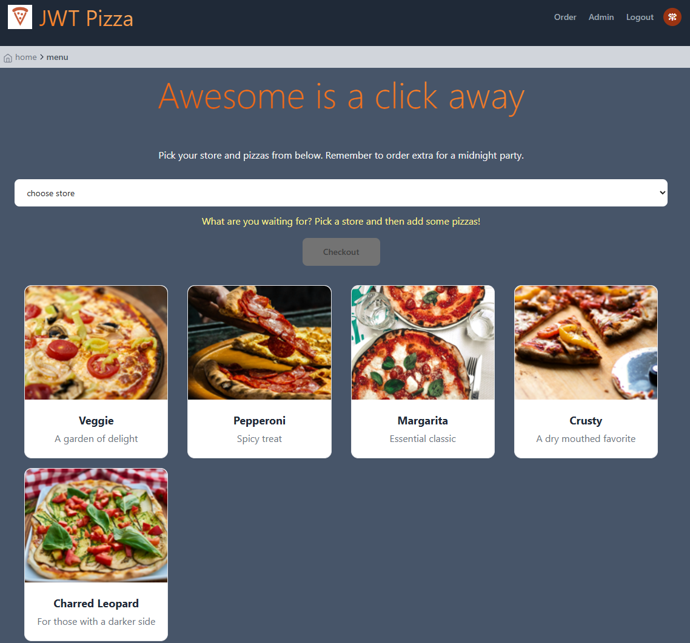
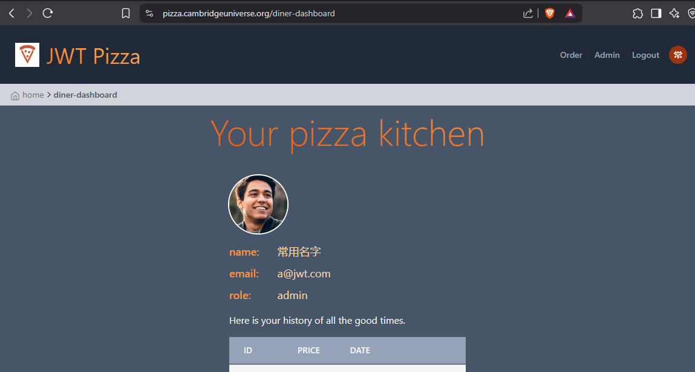
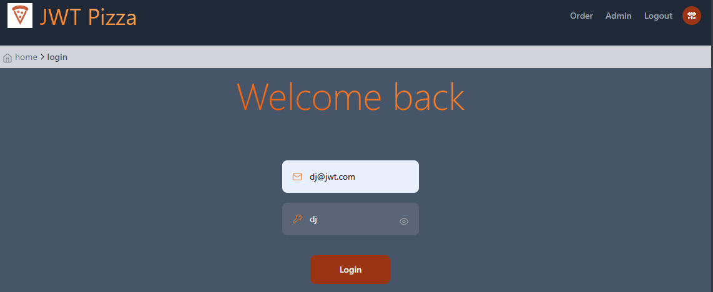
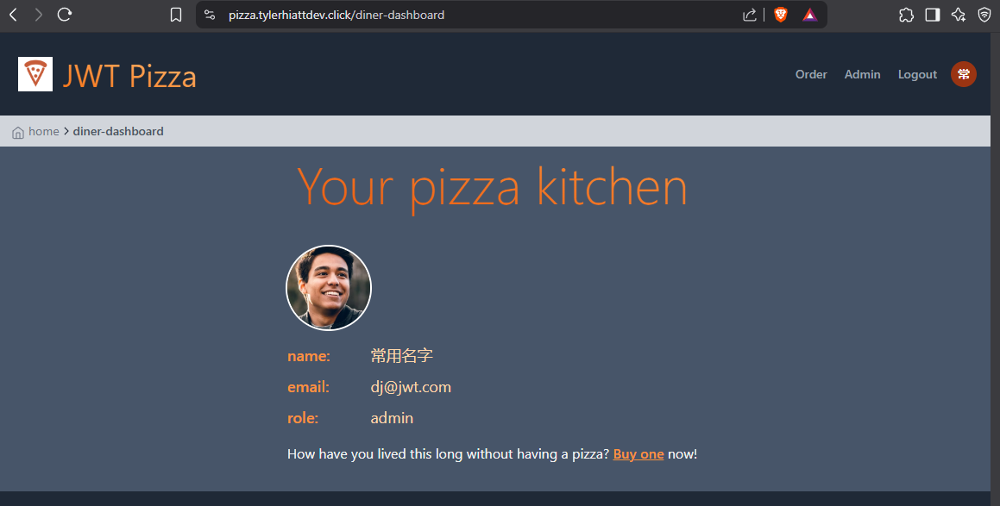
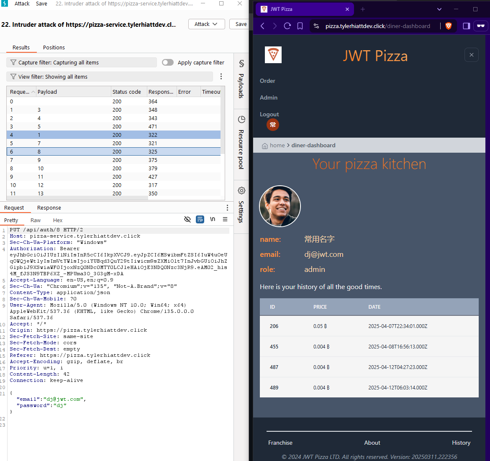
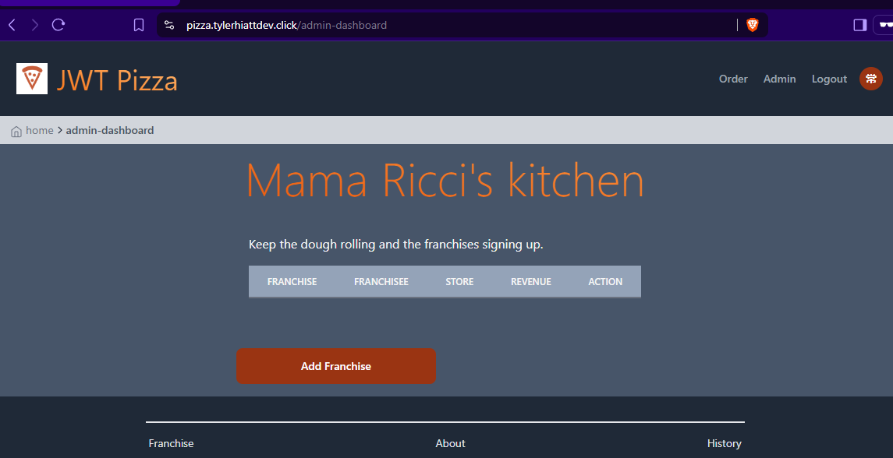

# Deliverable #12: Penetration Testing  
**Participants:** Andrew Cambridge and Tyler Hiatt  
## Self-Attacks  
### Andrew Cambridge  
#### Attack 1  
| Item           | Result                                                                         |
| -------------- | ------------------------------------------------------------------------------ |
| Date           | April 12, 2025                                                                  |
| Target         | pizza.cambridgeuniverse.org                                                       |
| Classification | Injection                                                                      |
| Severity       | 4                                                                              |
| Description    | Unable to penetrate database. It appears that SQL are sufficiently sanitized     |
| Images         |    Database data remained unaffected |
| Corrections    | None at this time.                                                          |  

Attack 2  
| Item           | Result                                                                         |
| -------------- | ------------------------------------------------------------------------------ |
| Date           | April 12, 2025                                                                  |
| Target         | pizza.cambridgeuniverse.org                                                       |
| Classification | Identification & Authentication Failures                                           |
| Severity       | 4                                                                              |
| Description    | Able to brute force administration password, allowing log in as admin. This allowed unrestricted access to stores and franchises, as well as the authtoken for the Attack 3 |
| Images         |    Database data remained unaffected |
| Corrections    | Require advanced passwords that aren't known to be common passwords                 |  

Attack 3  
| Item           | Result                                                                         |
| -------------- | ------------------------------------------------------------------------------ |
| Date           | April 12, 2025                                                                  |
| Target         | pizza.cambridgeuniverse.org                                                       |
| Classification | Security Misconfiguration                                                                      |
| Severity       | 4                                                                              |
| Description    | API endpoint exposed the admin users that allows user to update an arbitrary user's email and password. Using the authtoken from Attack 3, control was obtained over mutliple user accounts     |
| Images         |    Database data remained unaffected |
| Corrections    | Remove the endpoint that allows admins to change any user's information. This is a completely unnecessary endpoint in its current configuration. |

### Tyler Hiatt  

## Peer-Attacks  
### Tyler Hiatt attacking Andrew Cambridge  

### Andrew Cambridge attacking Tyle Hiatt  
Attack 1  
| Item           | Result                                                                         |
| -------------- | ------------------------------------------------------------------------------ |
| Date           | April 12, 2025                                                                  |
| Target         | pizza.tylerhiattdev.click                                                       |
| Classification | Identification & Authentication Failures                                           |
| Severity       | 4                                                                              |
| Description    | Able to brute force administration password, allowing log in as admin. This allowed unrestricted access to stores and franchises, as well as the authtoken for the Attack 2 |
| Images         |    Database data remained unaffected |
| Corrections    | Require advanced passwords that aren't known to be common passwords                 |  

Attack 3  
| Item           | Result                                                                         |
| -------------- | ------------------------------------------------------------------------------ |
| Date           | April 12, 2025                                                                  |
| Target         | pizza.tylerhiattdev.click                                                 |
| Classification | Security Misconfiguration                                                 |
| Severity       | 4                                                                              |
| Description    | API endpoint exposed the admin users that allows user to update an arbitrary user's email and password. Using the authtoken from Attack 2, control was obtained over mutliple user accounts. Also deleted all stores and franchies, disabling the ability to make purchase pizzas and make revenue.  |
| Images         |    Database data remained unaffected      All stores and franchises deleted |
| Corrections    | Remove the endpoint that allows admins to change any user's information. This is a completely unnecessary endpoint in its current configuration. |  

## Summary  
During the exercise, we found that the pizza code base was secured against our elementary SQL injection attacks. However, the presence of common admin accounts exposed the sites to significant damage.
Logging in as an admin allowed for the franchises and stores to be deleted, rendering the company's product completely unavailable. Additionally, having an administrator's authtoken allowed for calling
an API endpoint that updates any user's email and password. This allowed bad actors to lock out any number of users based on their numerically ascending ID, as well as gain access to their accounts with
the updated credentials.  